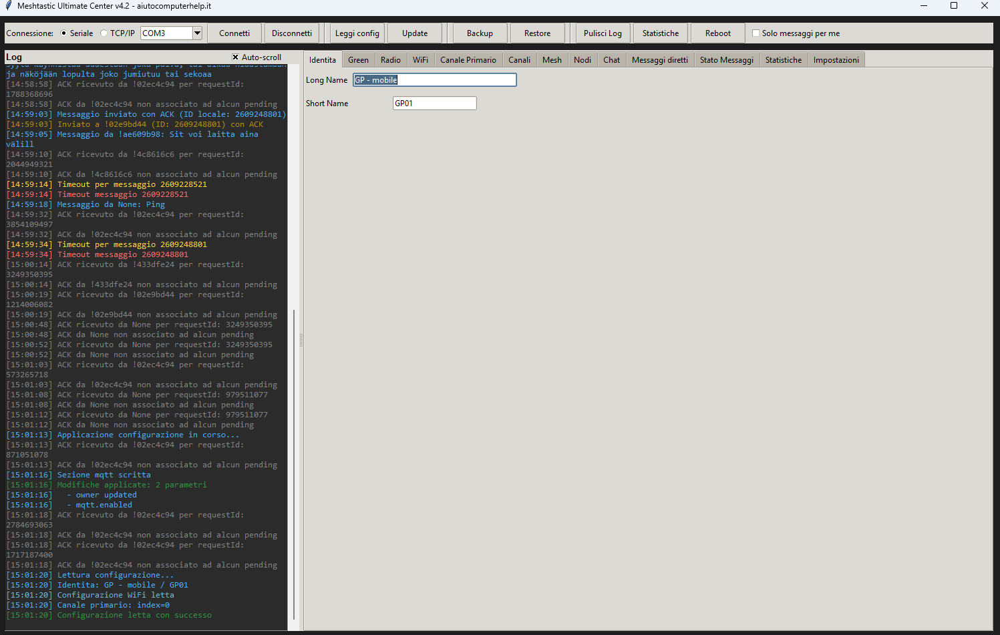
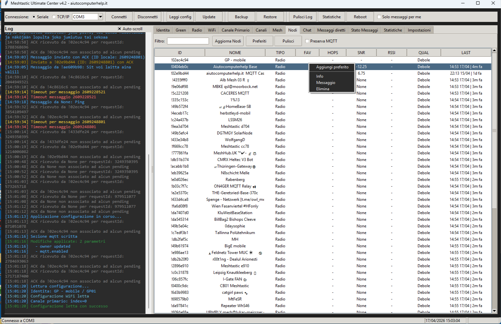
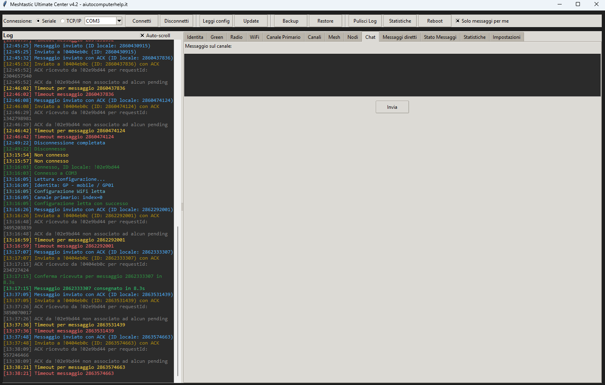
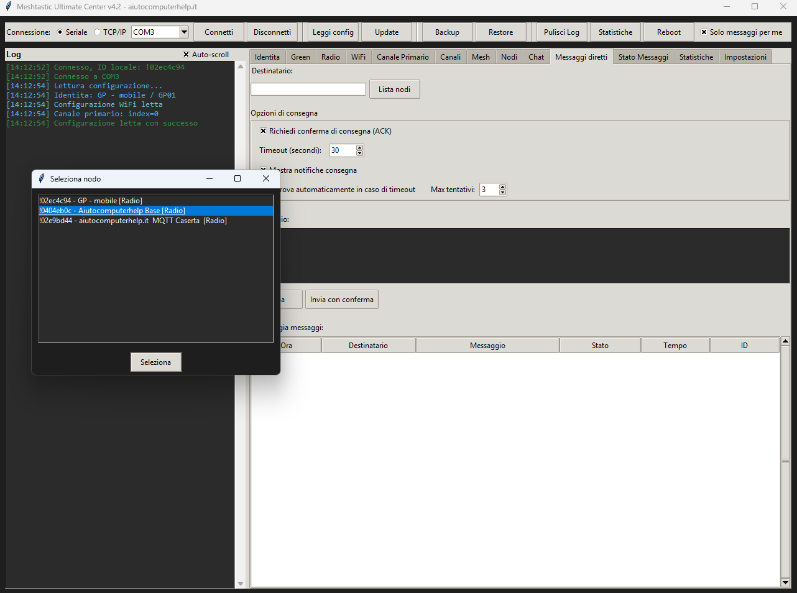
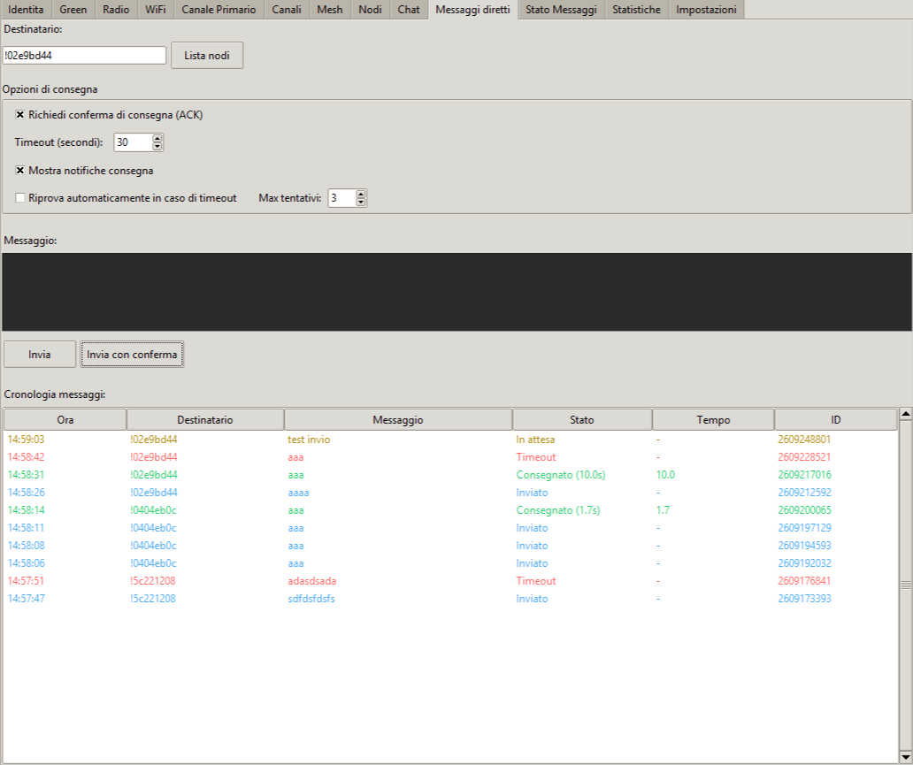
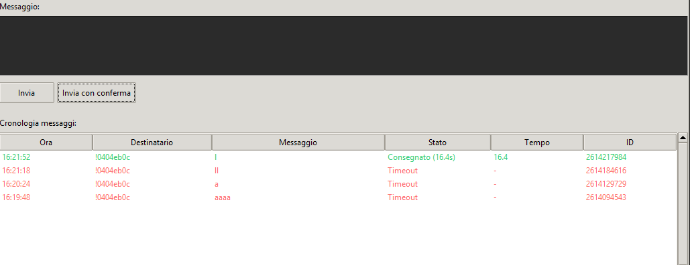
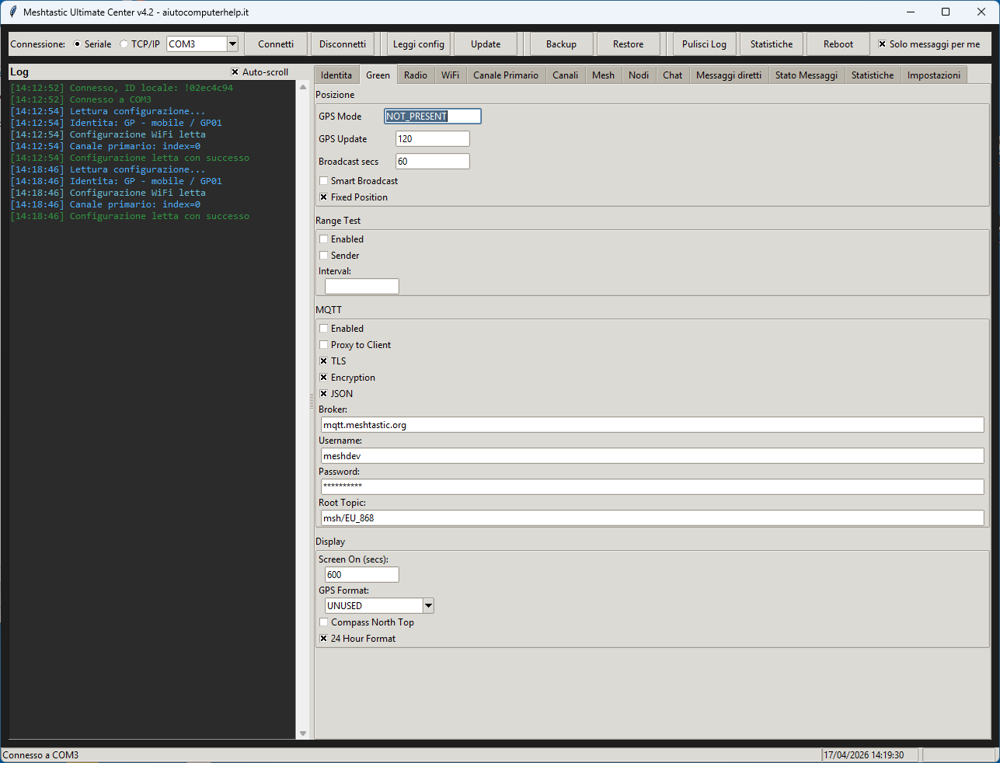
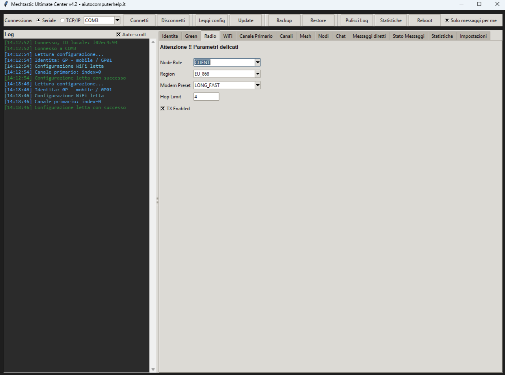
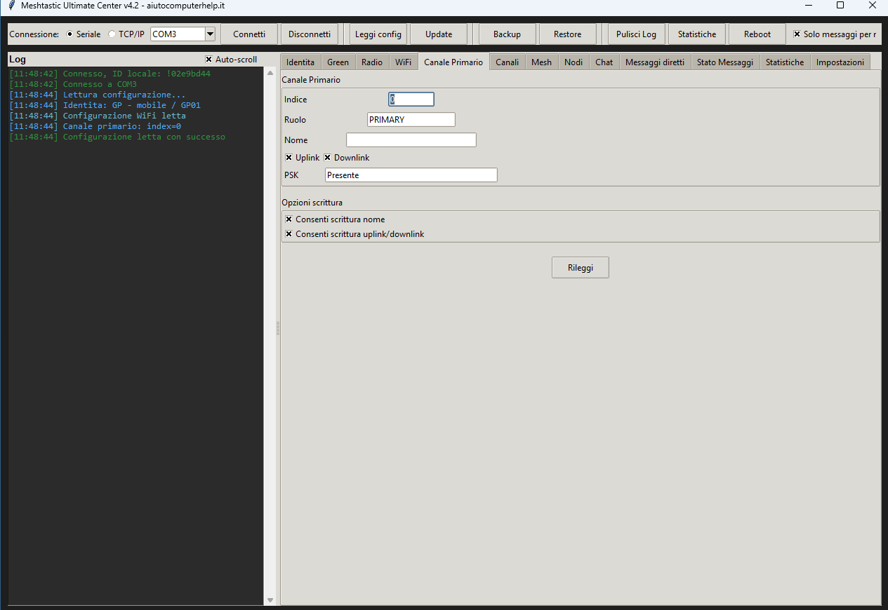
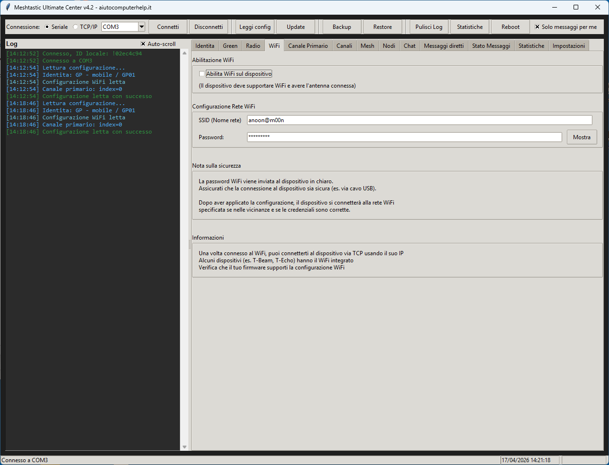

# Meshtastic Ultimate Center
## [English version](README.en.md)

Interfaccia desktop in Python con Tkinter per leggere, configurare e gestire un nodo Meshtastic da un'unica finestra.

Il progetto nasce con un'impostazione pratica: collegare il dispositivo via seriale o TCP, leggere la configurazione reale del nodo, intervenire sui parametri più utili e avere anche una parte operativa dedicata a nodi, chat, messaggi diretti, cronologia e conferme di consegna.

## Cosa fa

Meshtastic Ultimate Center espone una GUI articolata in più sezioni. Dalla toolbar è possibile collegarsi via seriale o TCP/IP, leggere la configurazione corrente, applicare modifiche, creare backup JSON, ripristinare uno snapshot e gestire alcune utilità operative. L'applicazione usa come cuore la classe `MeshtasticDevice`, che gestisce connessione, lettura dei nodi, invio messaggi, ACK, backup e restore della configurazione.

Le schede disponibili coprono identità del nodo, parametri di posizione e range test, MQTT, display, radio, WiFi, canale primario, altri canali, vista mesh, elenco nodi, messaggi di canale, messaggi diretti, stato dei messaggi, statistiche e impostazioni generali. La GUI è costruita attorno al notebook `MeshtasticUltimateCenter` e inizializzata da `main.py`.

Tra le funzioni più utili ci sono la gestione del canale primario, la scrittura selettiva delle sezioni di configurazione, il backup completo in JSON, il restore della configurazione, la lettura della lista nodi, i preferiti, il filtro rapido, l'invio di messaggi diretti con conferma di consegna, il controllo dei timeout ACK e la cronologia dei messaggi con statistiche di successo.

## Funzioni principali

### Connessione al nodo

Il progetto supporta collegamento seriale e collegamento TCP/IP. Dopo la connessione viene recuperato il nodo locale e viene sottoscritta la ricezione dei pacchetti Meshtastic.

### Lettura e scrittura configurazione

L'applicazione legge `localConfig`, `moduleConfig` e canali, quindi permette di modificare diversi gruppi di parametri come posizione, range test, MQTT, display, ruolo del nodo, impostazioni LoRa, WiFi e canale primario. Le sezioni cambiate vengono poi scritte in modo selettivo, con supporto a transazioni quando necessario.

### Backup e restore

È presente un backup completo della configurazione in JSON e un ripristino successivo dello snapshot, inclusi owner, localConfig, moduleConfig e canali.

### Gestione nodi

La GUI mostra la lista nodi, supporta filtro testuale, preferiti, menu contestuale e operazioni di pulizia. Nelle ultime correzioni è stata reintegrata anche la rimozione del nodo lato core tramite `remove_node()`, in modo coerente con i comandi della GUI. La vista usa anche il campo `lastHeard` per mostrare il contatto più recente.

### Messaggi e ACK

Il core gestisce invio testo semplice e invio con conferma di consegna. I messaggi in attesa vengono tracciati con timeout, storico e callback, mentre i pacchetti ricevuti vengono classificati tra testo e ACK. La GUI include una sezione dedicata ai messaggi diretti, una cronologia e una tab per le statistiche di consegna.

### Interfaccia desktop

L'interfaccia usa Tkinter e il tema `clam` quando disponibile. Lo stile visivo è definito in `constants.py`, con palette scura e colori dedicati a log, MQTT, WiFi, canali e stato ACK.

## Compatibilità hardware

L'applicazione non è limitata a Heltec V3. Il software usa la libreria Python di Meshtastic e si collega al dispositivo tramite interfaccia seriale o TCP/IP, quindi in linea generale può lavorare con nodi compatibili con Meshtastic anche di altri produttori.

La compatibilità effettiva di alcune sezioni dipende però da hardware e firmware. Funzioni come WiFi, GPS, display o alcune opzioni di configurazione possono essere presenti solo su determinati dispositivi oppure essere esposte in modo diverso a seconda della versione firmware.

## Struttura del progetto

```text
.
├── main.py        # entry point
├── gui.py         # interfaccia principale Tkinter
├── core.py        # logica di connessione e gestione Meshtastic
├── utils.py       # funzioni helper
├── constants.py   # costanti UI e stati
└── tabs.py        #  
```

## Requisiti

Il progetto usa Python e alcune dipendenze esterne. Dalle importazioni attuali risultano necessari almeno:

- `meshtastic`
- `pypubsub`
- `protobuf`
- `tkinter` già incluso in molte installazioni Python desktop
- `plyer` opzionale, usato per le notifiche desktop se disponibile

Le librerie richieste emergono direttamente dagli import in `core.py` e `gui.py`.

## Installazione

```bash
pip install meshtastic pypubsub protobuf plyer
```
## Installazione dipendenze con ambiente virtuale

```bash
python -m venv venv

### Windows
venv\Scripts\activate
pip install meshtastic pypubsub protobuf plyer

### Linux
source venv/bin/activate
pip install meshtastic pypubsub protobuf plyer

Su Linux potrebbe essere necessario installare anche il supporto Tk di sistema, perché l'interfaccia è basata su Tkinter.

## Avvio

```bash
python main.py
```
##  Con ambiente virtuale

### Windows
```bash
venv\Scripts\activate
pip install meshtastic pypubsub protobuf plyer
python main.py
```
### Linux
```bash
source venv/bin/activate
pip install meshtastic pypubsub protobuf plyer
python main.py
```

`main.py` crea la finestra principale Tkinter e inizializza la classe `MeshtasticUltimateCenter`.

## Flusso d'uso tipico

Si collega il nodo via seriale o TCP, si leggono configurazione e canali, si verificano identità e ruolo, si interviene sui parametri necessari, poi si salva un backup JSON prima di applicare modifiche più invasive. A livello operativo si possono controllare i nodi visti dal dispositivo, usare la chat di canale, inviare messaggi diretti con ACK e consultare lo storico delle consegne.

## Stato del progetto

Il progetto è pienamente orientato all'uso pratico e raccoglie sia funzioni di configurazione sia strumenti di osservazione della mesh. 

## Screenshot

### Panoramica

[](screenshot/home.png)

### Gestione nodi

[](screenshot/nodi.png)

### Chat di canale

[](screenshot/messages0.png)

### Messaggi diretti e conferme

[](screenshot/messages.png)
[](screenshot/messages2.png)
[](screenshot/messages3.png)

### Configurazione del nodo

[](screenshot/config1.png)
[](screenshot/config2.png)
[](screenshot/config3.png)
[](screenshot/config4.png)
## Note

Questo repository è pensato per chi vuole una console desktop unica per lavorare con dispositivi Meshtastic in modo più leggibile rispetto alla sola CLI, mantenendo però visibilità su configurazione, nodi, messaggi e stato operativo del device.

# Compatibilità hardware

L'applicazione non è limitata a Heltec V3.

Funziona in generale con dispositivi compatibili con Meshtastic che siano raggiungibili tramite:
- connessione seriale USB
- connessione TCP/IP

La compatibilità reale di alcune funzioni dipende però dall'hardware e dal firmware installato. Per esempio, opzioni come WiFi, GPS, display o alcune sezioni di configurazione possono essere disponibili solo su determinati dispositivi o su specifiche versioni firmware.

# Custom Software License
Copyright (c) 2026 Giovanni Popolizio. All rights reserved.

## 1. Grant of Use
Permission is granted to use this software solely in accordance with the terms of this license.

## 2. Restrictions
Redistribution, republication, sublicensing, resale, leasing, lending, sharing, or otherwise making the software available to any third party, in whole or in part, in original or modified form, is strictly prohibited.

## 3. Attribution
The author's name, copyright notice, and all attribution references must remain present, intact, and clearly visible in the software, documentation, and any authorized copy or use of the software.

## 4. Modifications
Modification of the software is permitted only for personal or internal use. Any modified version may not be redistributed, published, shared, sold, sublicensed, or transferred to third parties.

## 5. No Warranty
This software is provided "as is", without warranty of any kind, express or implied, including but not limited to warranties of merchantability, fitness for a particular purpose, non-infringement, reliability, availability, or security.

## 6. Limitation of Liability
Under no circumstances shall the author be liable for any direct, indirect, incidental, special, consequential, or exemplary damages, including but not limited to damages for loss of data, loss of profits, business interruption, service disruption, or any other commercial or personal damages arising out of or related to the use, misuse, or inability to use the software.

## 7. User Responsibility
The user assumes full responsibility for any improper, unlawful, unsafe, unauthorized, or technically incorrect use of the software.

## 8. Reservation of Rights
All rights not expressly granted under this license are reserved.

